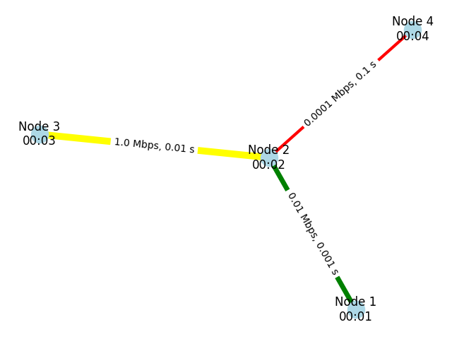

# ネットワークシミュレーター

Pythonを使ったネットワークシミュレーションの学習プロジェクト

[『Pythonで動かしながら学ぶ　コンピュータネットワーク』（中山　悠）｜講談社](https://www.kodansha.co.jp/book/products/0000416613)

## 実行方法

```bash
uv run python main.py
```

## 実装内容

### 1章: コンピュータネットワークの基本要素

ネットワークの基本要素を実装し、パケット転送とネットワークトポロジーの可視化を実現しました。

#### 主要クラス

- **Node**: ネットワークノード（ノードID、MACアドレス、パケット送受信機能）
- **Link**: ノード間のリンク（帯域幅、遅延、パケットロス率）
- **Packet**: データパケット（送信元、宛先、ペイロード）
- **NetworkGraph**: ネットワークトポロジーの管理と可視化

#### 機能

- ノード間のパケット送受信
- リンク特性の設定（帯域幅、遅延）
- NetworkXとMatplotlibを使ったネットワーク可視化
  - エッジの太さで帯域幅を表現
  - エッジの色で遅延を表現（緑: ≤1ms、黄: ≤10ms、赤: >10ms）

#### ネットワーク構成例



4つのノードで構成されるネットワーク:

- Node 1 ↔ Node 2: 10 Mbps, 1ms
- Node 2 ↔ Node 3: 1 Mbps, 10ms
- Node 2 ↔ Node 4: 100 bps, 100ms

### 2章: ネットワークと時間

### 3章: スイッチとMACアドレス

### 4章: MACアドレス学習とループ回避

### 5章: IPパケットとフラグメント

### 6章: ルーティングプロトコル

### 7章: レイヤとカプセル化

### 8章: アドレスの問い合わせ

### 9章: IPアドレスの配布と変換

### 10章: コネクションと信頼性

### 11章: 確認応答と再送制御

### 12章: 輻輳とウィンドウ制御

### 13章: 待ち行列と通信品質

### 14章: アプリケーションとデータ転送

### 15章: 暗号化と鍵交換
